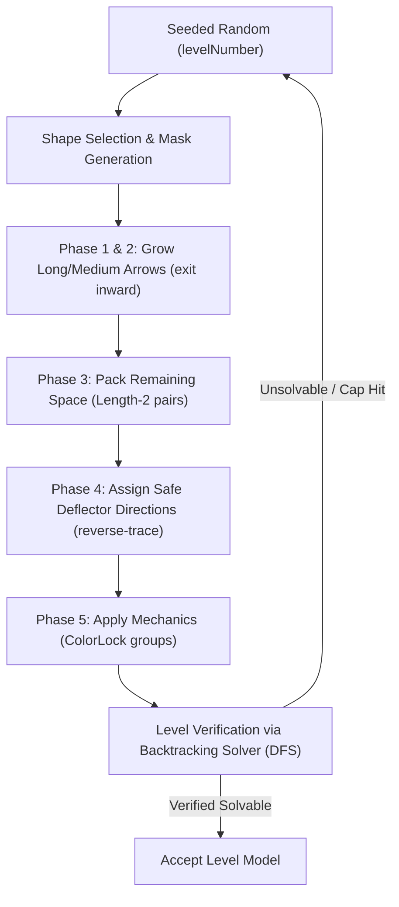

<div align="center">

  

# Arrow Out

**A modern, casual grid puzzle game where you slide arrows out of the grid. Built with Flutter & Flame.**

  <p>
    <a href="https://github.com/gtxPrime/arrow-out/stargazers">
      
    </a>
    <a href="https://github.com/gtxPrime/arrow-out/network/members">
      
    </a>
    <a href="https://github.com/gtxPrime/arrow-out/issues">
      
    </a>
    <a href="https://github.com/gtxPrime/arrow-out/blob/main/LICENSE">
      
    </a>
    <a href="#">
      
    </a>
    <a href="https://github.com/gtxPrime/arrow-out/releases/latest">
      
    </a>
  </p>

  <a href="https://github.com/gtxPrime/arrow-out/releases/latest">
    
  </a>

  <h3>
    <a href="#-features">Features</a>
    <span> | </span>
    <a href="#-tech-stack">Tech Stack</a>
    <span> | </span>
    <a href="#-game-engine">Game Engine</a>
    <span> | </span>
    <a href="#-project-structure">Project Structure</a>
    <span> | </span>
    <a href="#-installation">Installation</a>
    <span> | </span>
    <a href="#-monetization">Monetization</a>
  </h3>

</div>

---

##  About Arrow Out

> [!NOTE]
> **Arrow Out** is a beautifully designed, highly interactive grid-based puzzle game. Players navigate challenges by sliding arrows out of the grid, encountering progressively harder difficulties (from Easy up to Boss & Super Hard levels). Developed using the powerful Flame game engine for Flutter, it offers responsive animations, particle effects, and dynamic transitions.

---

## <a id="-features"></a> Core Features

###  Engaging Gameplay
* ✦ **Slide Mechanics:** Smooth grid movements with intuitive touch controls.
* ✦ **Progressive Difficulty:** Levels ranging from simple tutorial-like grids to mind-bending Boss and Super Hard configurations (up to 500 levels).
* ✦ **Deflector Dots (Orphan Dots):** Isolated cells remaining after generation are converted to deflectors. 
  * Starting levels ($\le 20$) feature neutral (grey) dots that arrows pass straight through.
  * Higher levels introduce red (clockwise/right) and blue (counter-clockwise/left) deflector dots.
* ✦ **Daily Streaks:** Tracks user gameplay consistency and records daily play sessions.
* ✦ **Lives System:** Keep track of remaining lives with custom visual meters and animated indicators.

###  Visual & Sound Effects
* ✦ **Juicy Animations:** Utilizes `flutter_animate`, Confetti, and custom Lottie integrations for satisfying level-complete feedback.
* ✦ **Soundtracks & SFX:** Rich audio feedback powered by `flame_audio` and `audioplayers` for sliding, matching, winning, and losing states.
* ✦ **Premium UI:** Designed with HSL-tailored colors, smooth gradients, and custom Nunito typography.

---

## <a id="-tech-stack"></a> Tech Stack

- **Framework:** [Flutter](https://flutter.dev/) (SDK `>=3.0.0 <4.0.0`)
- **Game Engine:** [Flame Engine](https://flame-engine.org/) & [Flame Audio](https://github.com/flame-engine/flame/tree/main/packages/flame_audio)
- **State Management:** [Provider](https://pub.dev/packages/provider)
- **Animations:** [Flutter Animate](https://pub.dev/packages/flutter_animate), [Lottie](https://pub.dev/packages/lottie), [Confetti](https://pub.dev/packages/confetti)
- **Local Storage:** [Shared Preferences](https://pub.dev/packages/shared_preferences)
- **Typography & Icons:** [Google Fonts](https://pub.dev/packages/google_fonts), [Lucide Icons](https://pub.dev/packages/lucide_icons_flutter)

## <a id="-game-engine"></a> Game Engine & Level Generation

The game leverages the **Flame Engine** (a modular Flutter game engine library) to manage high-frequency rendering ticks, touch gestures, physics simulation, and particles.

###  Game Loop & Engine Flow
The game loop runs on a dual-phase execution tick:
1. **Update Phase (`update(double dt)`)**: Evaluates real-time animations (e.g. arrow slide offsets, rotation angles, particle decay times) and updates the logical coordinate grid in `GameState`.
2. **Render Phase (`render(Canvas canvas)`)**: Draws grid cells, deflector plates, standard arrows, and particle effects directly onto the double-buffered screen canvas.

###  The Level Generation Pipeline
Every level is fully generated programmatically and deterministically from a level number seed:



- **Seeded Randomness**: Uses `Random(levelNumber * 103 + 51)` to produce identical layouts for a given level ID across all player devices.
- **Inward Growth (Phases 1 & 2)**: Starts by finding exit boundary cells and growing arrow paths inward. This guarantees that at least a subset of arrows can exit without obstructions.
- **Length-2 Packing (Phase 3)**: Sweeps remaining isolated tiles using a center-out shuffled search grid, preventing clustering of small arrows.
- **Reverse Exit Deflector Routing (Phase 4)**: Unassigned orphan cells are converted to redirect dots. The generator simulates arrow exits in reverse construction order and configures deflection directions that guarantee a safe path to the grid boundaries.
- **Solver Backtracking DFS Verification**: A custom depth-first search solver parses the generated board. The layout is accepted only if it solves within a dynamic state cap (1000 states for small grids, 2500 states for grids larger than 20x20). Otherwise, it resets the seed and restarts generation.

###  Arrow Definition & Components
Arrows are modeled in `ArrowModel` and rendered by `ArrowComponent`:
- **Logical Model (`ArrowModel`)**: Defines the ID, head cell coordinate `(row, col)`, exit direction `ArrowDirection` (up, down, left, right), coordinate segment list (`path`), state (idle, sliding, blocked, exited), and color-locked grouping ID.
- **Visual Component (`ArrowComponent`)**: Standard arrows are drawn with a curved head, distinct segment separators, and a flat tail. They automatically compute slide offsets and orientation rotations dynamically during slide transitions.

###  Algorithmic Mechanics

The generator models the puzzle constraints mathematically to guarantee solvable and challenging states:

#### 1. Dynamic Grid Scaling
The board dimensions grow dynamically as a function of the level number:
$$\text{Grid Size } (G) = \text{clamp}\Big(10, \,\, 10 + \big\lfloor (L - 3) \times 0.115 \big\rfloor, \,\, 30\Big)$$
where $L$ represents the level number.

#### 2. Deflector Density (Orphan Bounds)
The target quantity of deflector dots is computed as a percentage of the total active mask area ($M$) and is capped:
$$E_{\text{max}} = \text{clamp}\Big(5, \,\, \lceil M \times P \rceil, \,\, 150\Big)$$
where the density coefficient $P$ scales based on grid dimensions:
$$P = \begin{cases} 16\% & \text{if } G > 20 \\ 22\% & \text{if } G \le 20 \end{cases}$$

#### 3. Arrow Type Distributions
The arrow lengths follow a discrete target ratio among standard paths ($\text{Length} \ge 3$):
- **Medium Arrows** ($3 \le \text{Length} \le 5$): $\approx 65\%$
- **Long Arrows** ($\text{Length} \ge 6$): $\approx 35\%$

#### 4. Solvability Constraints
A board state $S = (A, D)$ is solvable if there exists a valid slide sequence $\pi$:
$$\pi = (a_1, a_2, \dots, a_N) \in \text{Permutations}(A) \quad \text{s.t.} \quad \forall i, \,\, a_i \xrightarrow{\text{slide}} \text{Exit}(G, D_{i-1})$$
where $D_{i-1}$ represents the remaining deflector dot configurations on the grid after removing $a_1 \dots a_{i-1}$.

---

## <a id="-project-structure"></a> Project Structure

```
lib/
├── core/                   # Application constants, theme colors, and helper functions
├── data/
│   ├── models/             # Game models (Level, Arrow, Grid cell representations)
│   └── repositories/       # Level state and user progress persistence
├── game/
│   ├── components/         # Flame Components (Grid, Arrows, Particle systems)
│   ├── arrow_puzzle_game.dart # Main Flame Game Controller
│   └── game_state.dart     # In-game state machine and progression handlers
├── screens/
│   ├── game_over/          # Game Over and retry logic
│   ├── main_menu/          # Main Menu, levels selector, and daily streak UI
│   └── play_screen/        # Main gameplay viewport wrapping the Flame widget
└── widgets/                # Reusable UI controls (e.g. LivesBar, ActionButton)
```

---

## <a id="-installation"></a> Installation

Follow these instructions to run the game locally:

### 1. Prerequisites
- Install the [Flutter SDK](https://docs.flutter.dev/get-started/install) (Ensure it is in your system `PATH`).
- Run `flutter doctor` to verify correct environment setup.

### 2. Setup Codebase
Clone this repository and fetch the dependencies:
```bash
git clone https://github.com/gtxPrime/arrow-out.git
cd arrow-out
flutter pub get
```

### 3. Run the Game
Ensure you have an active emulator or real device connected:
```bash
flutter run
```

### 4. Build Executables
* **Android APK:**
  ```bash
  flutter build apk --release
  ```
* **Android App Bundle (for Play Store publishing):**
  ```bash
  flutter build appbundle --release
  ```

---

## <a id="-monetization"></a> Monetization & Configuration

### AdMob Integration
To configure your live ads, update `lib/core/constants.dart`:
- `admobAppIdAndroid` → Your Google AdMob App ID
- `admobBannerUnitId` → Your Banner Ad Unit ID
- `admobInterstitialUnitId` → Your Interstitial Ad Unit ID
- `admobRewardedUnitId` → Your Rewarded Video Ad Unit ID

Also update the `<meta-data>` in [AndroidManifest.xml](file:///f:/Source%20Codes/Arrow%20game/android/app/src/main/AndroidManifest.xml) with your AdMob App ID.

### Unity & Facebook Ads Mediation
- **Facebook Audience Network:** Set up your adapter through your AdMob Mediation setup. No extra code changes needed.
- **Unity Ads:** Get your Game ID from the Unity Dashboard, then update `AppConstants.unityGameId` and set `unityTestMode = false`.

---

## Star History

[](https://star-history.com/#gtxPrime/arrow-out&Date)

